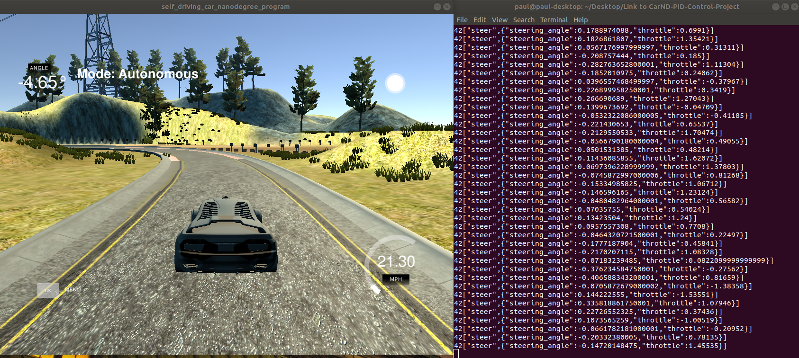

# CarND-Controls-PID
Self-Driving Car Engineer Nanodegree Program

##### Author: Pengmian Yan

##### Created on: Mar 16, 2019

##### Version: 1.0

## 1. Project Introduction

In this project, I implemented a PID controller in C++ to maneuver the vehicle around the track in simulator! 

The simulator provides the cross track error (CTE) and the  velocity (mph) and get the computed the steering angle back from my PID controller.

##### Release log:

v 1.0: This is the first version, parameters were just manually adjusted. 

v 2.0: This version is coming ...


## 2. Demo of Result

As a result my PID controller passed the [project rubic](https://review.udacity.com/#!/rubrics/1972/view) of Udacity. The car drove successfully at least a lap around the track in simulator without leaving the drivable portion of the track surface.

As shown below, left is the situation in simulator. On the right side we can see the output of PID controller (steering angle and throttle), which will be sent to the simulator. 

[The Whole Video](https://youtu.be/IJm5FEVqVgM)




## 3. Running the Code

### 3.1 Simulator.

You can download the Term3 Simulator which contains the Path Planning Project from [here](https://github.com/udacity/self-driving-car-sim/releases).  

### 3.2 Dependencies

- cmake >= 3.5

- All OSes: [click here for installation instructions](https://cmake.org/install/)

- make >= 4.1(mac, linux), 3.81(Windows)

  - Linux: make is installed by default on most Linux distros
  - Mac: [install Xcode command line tools to get make](https://developer.apple.com/xcode/features/)
  - Windows: [Click here for installation instructions](http://gnuwin32.sourceforge.net/packages/make.htm)

- gcc/g++ >= 5.4

  - Linux: gcc / g++ is installed by default on most Linux distros
  - Mac: same deal as make - [install Xcode command line tools]((https://developer.apple.com/xcode/features/)
  - Windows: recommend using [MinGW](http://www.mingw.org/)

- [uWebSockets](https://github.com/uWebSockets/uWebSockets)

  - Run either `./install-mac.sh` or `./install-ubuntu.sh`.

  - If you install from source, checkout to commit `e94b6e1`, i.e.

    ```
    git clone https://github.com/uWebSockets/uWebSockets 
    cd uWebSockets
    git checkout e94b6e1
    ```

    Some function signatures have changed in v0.14.x. See [this PR](https://github.com/udacity/CarND-MPC-Project/pull/3) for more details.

### 3.3 Basic Build Instructions

1. Clone this repo.
2. Make a build directory: `mkdir build && cd build`
3. Compile: `cmake .. && make`
4. Run it: `./pid`.

or 

1. Clone this repo.
2. Run the script : `./sh run.sh`


## 4. Input & Ouput of the PID controller

#### 4.1 Input

Following information will be provided from the simulator:

["cte"] The car's cross track error to the reference trajectory.

["speed"] The car's speed in mph.

["angle"] The car's steering angle. 

#### 4.7 Output

Following target control value will be send to the actuator in the simulator:

["steering_angle"] The car's target steering angle to for the lateral control.

["throttle"] The car's throttle to control the speed. 


### 5. Implementation of my PID controller

### 5.1 PID controller

The overall control function of a PID controller can be expressed mathematically as:


where Kp, Ki, and Kd, all non-negative, denote the coefficients for the proportional, integral, and derivative terms respectively (sometimes denoted P, I, and D).  (from [Wikipedia](https://en.wikipedia.org/wiki/PID_controller))

In the following figure are different controller compared. If we only have the proportional term (P), we will get over-shoot on the reference, which will cause a big oscillation movement. For this reason we add the derivative term (D). If the system has bias, then the integral term (I) would be necessary. 


I implemented the class "PID" in PID.h and PID.cpp. A PID controller for longitudinal and a PID controller for lateral control ware used in main.cpp. The desired velocity depends on the steering angle of car, which almost indicates the curvature of the track. The car should drive slower in the curve than straight r The longitudinal PID controller is aimed to reach/keep the desired speed. The lateral PID controller is used to keep the car in the middle of road. 

Through manual tuning I get following parameter set for the two PID controller:

|                             |  Kp  |  Ki   |  Kd  |
| :-------------------------: | :--: | :---: | :--: |
| longitudinal PID controller | 0.1  |   0   |  3   |
|   lateral PID controller    | 0.2  | 0.003 |  5   |

The car seems to have no noticeable bias in the steering but the Ki is helpful for the curves. 

### 5.2 Code Structure

All my codes are in the folder "src". 

The directory structure of this repository is as follows:

```
root
|   build.sh
|   clean.sh
|   CMakeLists.txt
|   README.md
|   run.sh    
|
|___result
|   |   compare.png  
|   |   PID_controller_v1.0.png 
|   |   PID_fomula.png
|   
|___src
    |   main.cpp
    |   json.hpp
    |   PID.h       
    |   PID.cpp
```


---


## 6. Code Style

The code style in this project is according to  [Google's C++ style guide](https://google.github.io/styleguide/cppguide.html).


## 7. Thanks

1. Thank Udacity for providing the interesting project, the original Udacity repo could be found [here](https://github.com/udacity/CarND-PID-Control-Project);
2. Thank the mentors and other students in the program;
3. etc.

# 
